# To Integrate Weather API in Oracle Integration Cloud Service (OIC)

## Introduction

This lab will take you through the steps needed to provision Oracle Integration Cloud Service and integrate OIC with the Weather API

Estimated Time: 120 minutes

### About OCI Integration Cloud Service

Oracle Integration Cloud Service is a complete, secure, but lightweight integration solution that enables you to connect your applications in the cloud. It simplifies connectivity between your applications, and can connect both your applications that live in the cloud and your applications that still live on premises. Oracle Integration Cloud Service provides secure, enterprise-grade connectivity regardless of the applications you are connecting or where they reside.

### Objectives

In this lab, you will:

* SignUp for Weather API which is publicly available
* Provision Oracle Integration Cloud Service
* Integrate the Weather API using OIC by configuring connections and importing integration

### Prerequisites

This lab assumes you have:

* All previous labs successfully completed
* Must have an Administrator Account or Permissions to manage several OCI Services: Oracle Integration Cloud Service

## Task 1: Signup for Weather API

This task will help you ensure that the required access to the Weather API using the API Key is available. If the API Key access is not there, please get the API keys as follows.

The weather API provides Real-time or current weather access to near real-time weather information for millions of locations worldwide by global collaborations of weather stations and high resolution local weather models.

1. Goto the URL and sign up with details
   https://www.weatherapi.com/signup.aspx
   Please provide the Email,Password and Sign up.Click Sign up

    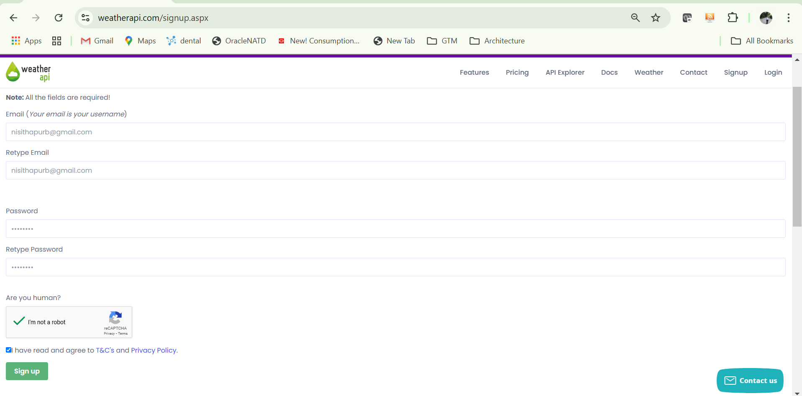

2. Do the account verification Please login into your email account and click on the verification link
   provided within this email to verify your email address.

    

3. To complete your account verification, please click the link as provided in your email

    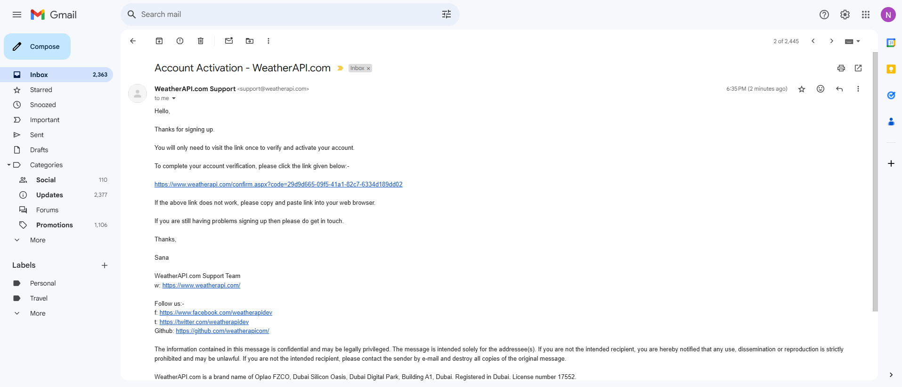

    **Note** The name of your account can be different.

4. Once verified you will get a message for successful Email Verification.

    

5. Now login to the WeatherAPI with the Email and Password provided in Step1.Click Login

    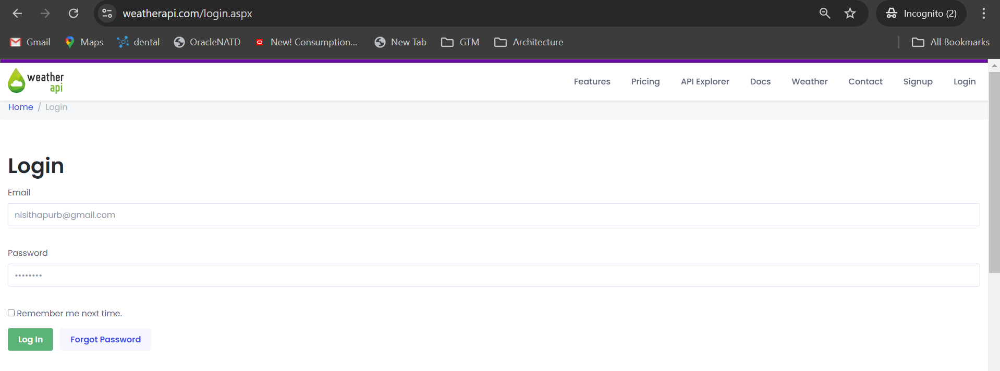

    **Note** The name of your account can be different.

6. In the Dasboard click the API and Copy the API key for completing your lab later

    

## Task 2: Provision Oracle Integration Cloud

This task will help you to create Oracle Integration Cloud under your chosen compartment.

1. Locate Integration under Developer Services in Application Integration

    

    **Note** You can find Oracle Integration under the Deevloper Services

2. Click Create Instance

    

3. Provide the information for Name , Edition Enterprise & License type as Subscribe to a new Oracle Integration License
   and Message packs as 1.Click Create

    

4. In few minutes the status of recently created Oracle Integration will change from Creating to Active

    

## Task 3: Create User with admin roles to manage and run the integrations in Oracle Integration Cloud

This task will help you ensure that the required users are correctly defined. If the Users/Roles are not correctly defined, please define them as follows.A user with the ServiceAdministrator service roles is a super user who can manage and administer the features provisioned in an Oracle Integration instance

1. Locate Domains under Identity & Security

    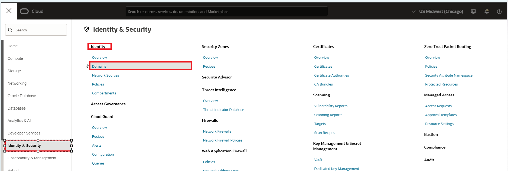

2. Click on your current domain name

    

3. In the Users Menu Click Users to create a  new user devuser3.
   Provide the Last name and Username and your email and Uncheck the checkbox Use the email address as the username

    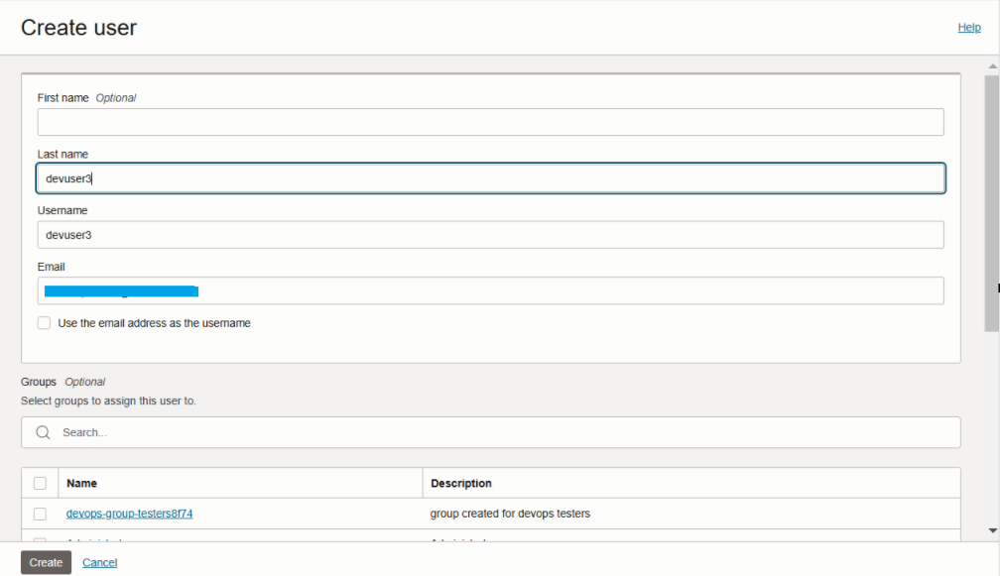

4. You will get an email notification to activate your account.Please Activate Your Account using the link given in the email

    

5. Please reset the password of your choice matching the Rules and Click Reset Password

    

6. The password has been reset for the user devuser3.Keep this password handy as it will be required later in the Livelab

    

7. Goto Identity>>Domains>>Default domain>>Oracle Cloud Services and search with the name of  the OIC Instance  that was created in
   Task2 in Lab3

    
    

8. Click on the required Oracle Cloud Services

    

9. Goto Application Roles and Expand ServiceAdministrator role

    

10. Click Manage and then Click the Show available users and search based on the user devuser3

    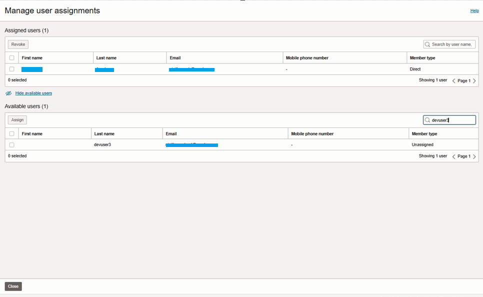

11. Select the User and Click Assign to assign the user

12. The User has now been assigned to Service Administrator role

    

13. Click Close

## Task 4: Import the integration service in Oracle Integration Cloud

This task will help you to import the required integrations along with the related artifacts like Integrations,Connections,Lookups and Libraries in the Oracle Integration instance.

1. Goto Developer Services>>Application Integration >>Integration in your compartment to open the OIC Console

    

2. Click on the OIC Instance Name

    

3. Click Open Console to launch the Homepage of OIC

    

4. The OIC Homepage is now opened

    

5. Click on Design

    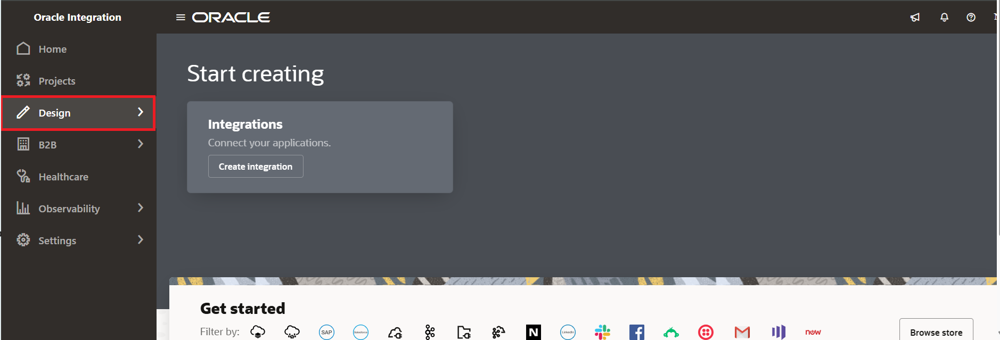

6. Then Click on Integrations and Click Import to import the integration into this OIC instance

    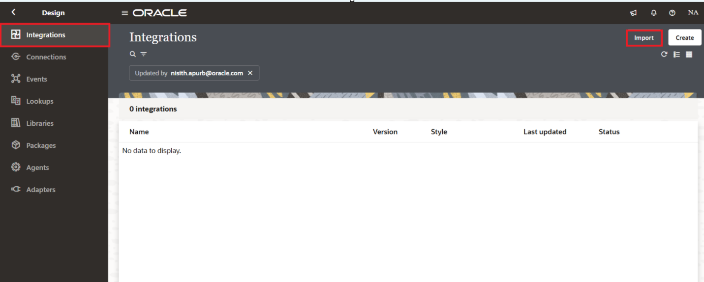

7. Click on Drag and Drop to Import the OIC Integration by importing the .iar files.Click Import

    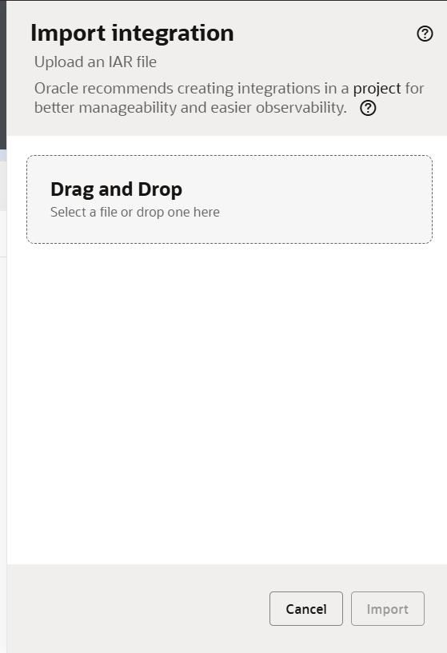

8. Goto the path where the .iar file is located and Click Open

    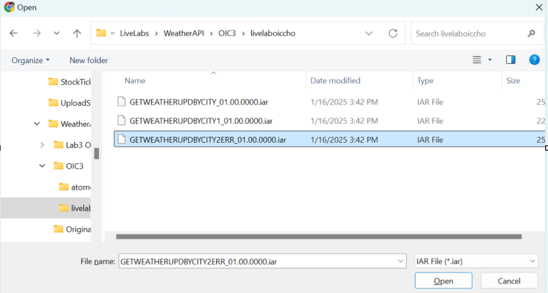

9. Click Import

    

10. In the Configuration Editor Click on the Edit Icon to modify the connection parameters for the NARestWeatherTrigger Connection

    

11. Modify the Properties like Connection URL and Security as Basic Authentication and provide the Username and password with Access
    Type as Public Gateway

    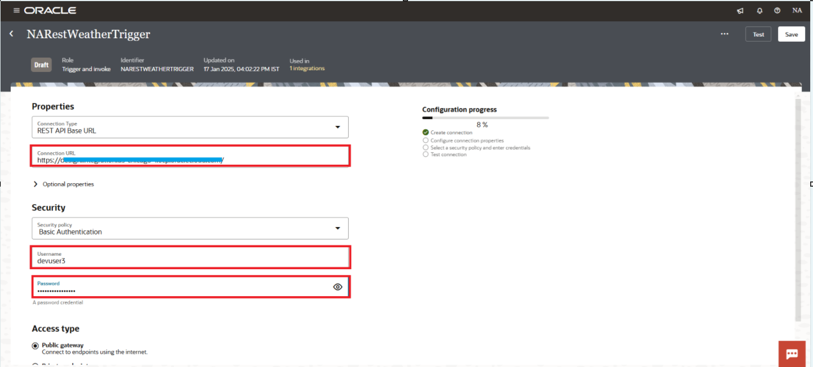

12. Click On Test to test the connection that has been configured just now.
    Ensure you get a successful Message after clicking on Test.

13. Click on Save to save the connection and also on Save changes click save?

    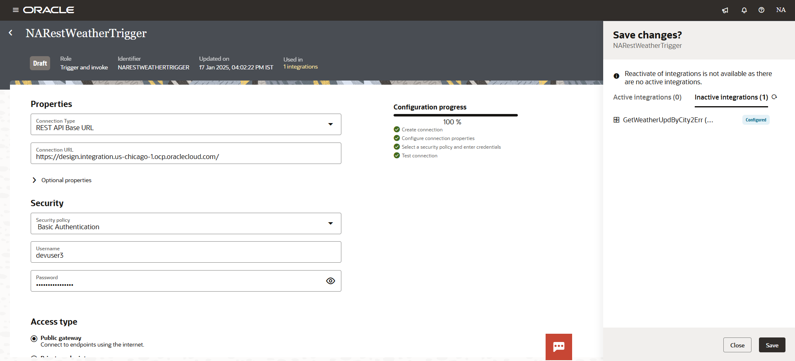

14. Ensure you get a successful Message after clicking on Save. Now Click on the Back Icon to configure the other connection

    

15. Once the first connection is configured Click on the Edit Icon to modify the other connection

    

16. Modify the Properties like Connection URL and Security as API Key Based  Authentication and provide the API Key (Lab3 Task1 Step6)
    with Access Type as Public Gateway

    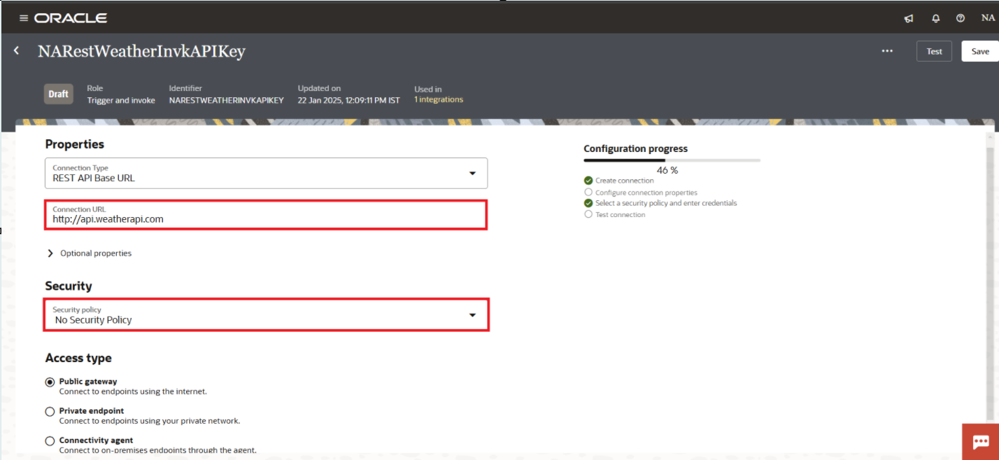

17. Click On Test to test the connection that has been configured just now.
    Ensure you get a successful Message after clicking on Test.

18. Click on Save to save the connection and also on Save changes? Click Save

    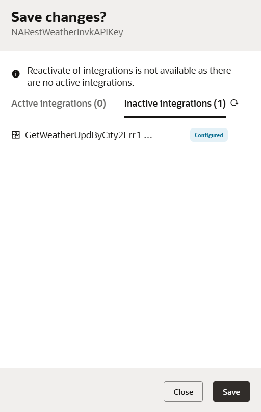

19. Ensure you get a successful Message after clicking on Save. Now Click on the Back Icon to to review the Integration

    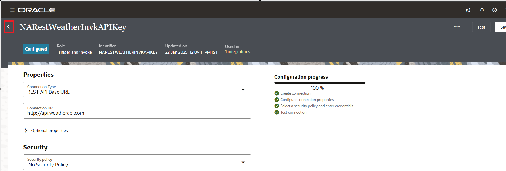

20. Now both the required connections are Configured as shown below

    

21. Click back on the Configuration Editor to Activate the Integration

    

22. Hover over the Integration and Click Activate to activate the integration

    

23. Select Tracing Level as Debug and click Activate

    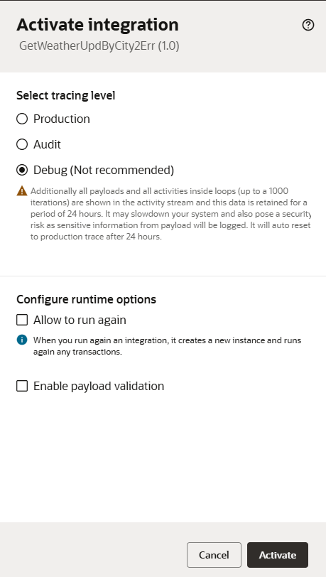

24. Once the Integration is in Active state Click on actions and then click Run to run the integration

    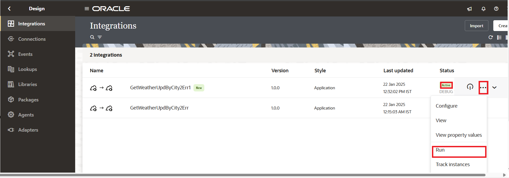

25. The Integration test looks like

    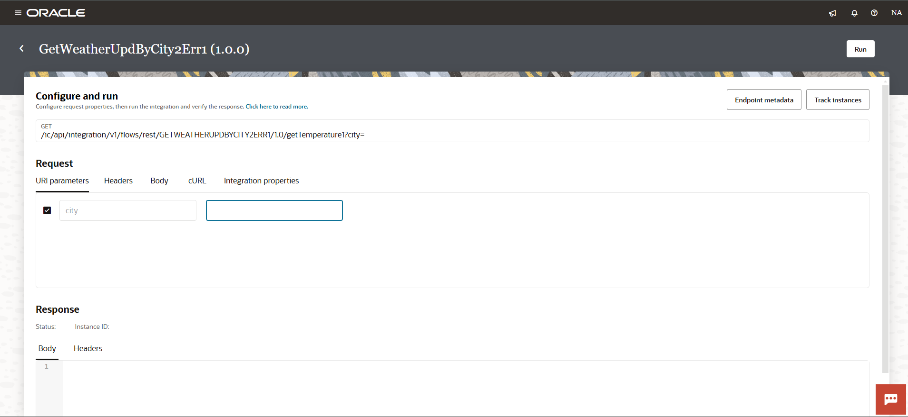

26. Provide the City Name as London and Click Run to see the response from the integration service

    

27. Once the integration runs successfully it will give a Response Code as 200 OK  and the desired outputs in the Body in JSON format

    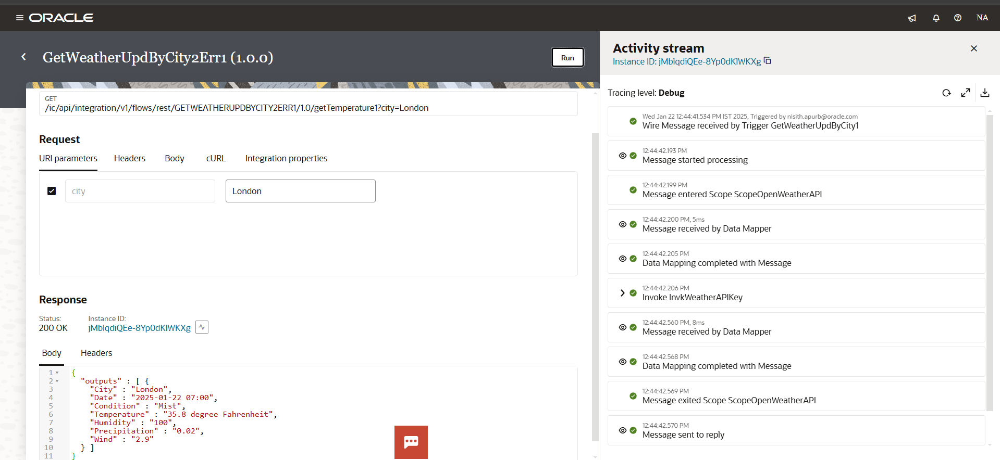

28. Copy the endpoint URL and provide it alongwith the Username/Password to the external applications like Oracle Digital Assistant
    https://******-**************************************************** /ic/api/integration/v1/flows/rest/GETWEATHERUPDBYCITY2ERR/1.0/getTemperature1?city=[city-value]

    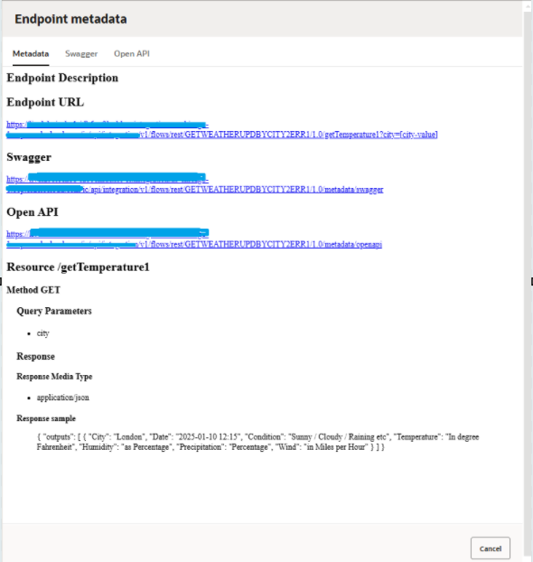

    Click Cancel once you have copied the Endpoint URL
    This concludes the OIC Lab !

## Acknowledgements

* **Author**
    * **Nisith Apurb**, Principal Cloud Architect, NACIE
* **Last Updated By/Date**
    * **Nisith Apurb**, Principal Cloud Architect, January 2025
